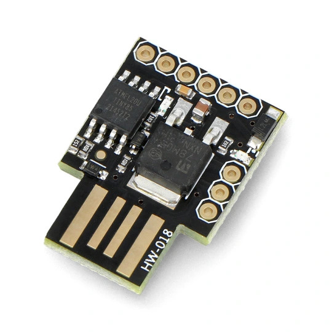
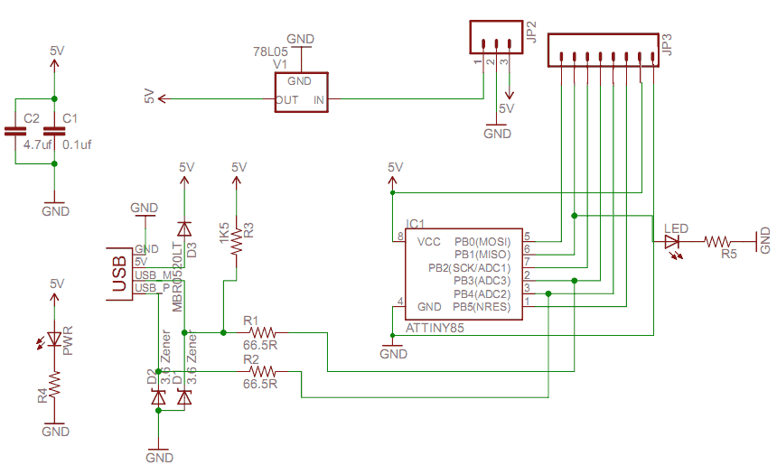

Next, simple FTDI UM201XB or Holtek HT42B532-x replacement.

By default it acts as UM201XB TWI/I2C slave device at the address 0x22.
It passes all data from TWI/I2C interface to USB UART.
HW USI peripherial is used and SW USB implementation.

For a Holtek the TWI address must be changed to be current one.

Maximal length of the single receive transfer 64 bytes.

Checked with a Digispark board

Connections:
- SCL (PB2)
- SDA (PB0)
- GND

Project uses 2 libraries:
 - TineyWireS e.g. https://github.com/rambo/TinyWire.git
 - DigiCDC from Digispark board support 